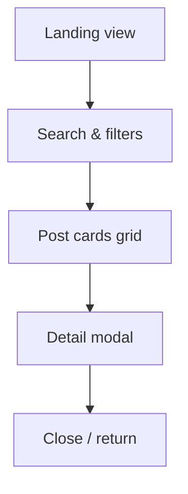

# Reddit Client

A responsive React and Redux application that delivers curated Reddit-style content with search, filters, and detailed post previews.

## Project Overview

- Built with React, Redux Toolkit, and CSS animations.
- Includes unit tests with Jest and Enzyme.
- Includes end-to-end tests using Cypress.
- Designed for desktop and mobile browsers.
- Ready for GitHub Pages deployment and CI/CD.

## Wireframes

## Technologies Used

- React 17
- Redux Toolkit
- React Redux
- Jest + Enzyme
- Cypress
- CSS Modules and transitions
- GitHub Actions (CI / deploy-ready)

## Features

- Initial content loads immediately from curated data.
- Search posts by title, author, or summary.
- Filter posts by predefined categories.
- Sort the feed by newest, score, or comments.
- Clear filters quickly and reset the feed.
- Detailed modal view for each post.
- Responsive layout for mobile and desktop.
- Loading, empty, and error states with recovery actions.
- Animations throughout the interface.

## Future Work

- Connect to Reddit API for live updates.
- Add user authentication and saved favorites.
- Expand categories and sorting controls.
- Add progressive web app offline support.
- Deploy to a custom domain.
- Progressive Web App support for install and offline caching.

## Getting Started

1. Install dependencies: `npm install`
2. Start the app: `npm start`
3. Run unit tests: `npm test`
4. Run e2e tests: `npm run test:e2e`

## Deployment

This project is configured for GitHub Pages deployment.

To deploy:

1. Set `homepage` in `package.json` to your repository path if needed.
2. Run `npm run deploy`.

The app also includes a simple Progressive Web App service worker for offline asset caching.

## Project Planning

See `PROJECT_PLAN.md` for the planned tasks and milestones.
